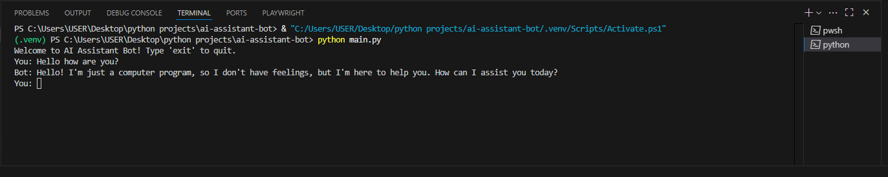
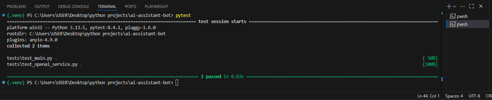

# 🤖 AI Assistant Bot

[](https://github.com/eduardogallifaochoa/ai-assistant-bot/actions)


[](https://codecov.io/gh/eduardogallifaochoa/ai-assistant-bot)


A **console-based chatbot** powered by **OpenAI GPT-3.5/4**, built with **Python**, **Pytest**, and **GitHub Actions CI**.

---

## ⚙️ Quick Start
```bash
git clone https://github.com/yourusername/ai-assistant-bot.git
cd ai-assistant-bot
python -m venv .venv && source .venv/bin/activate  # Windows: .venv\Scripts\activate
pip install -r requirements.txt
echo "OPENAI_API_KEY=your-api-key" > .env
python main.py
```

## 🧪 Tests
```bash
pytest
```
CI runs tests automatically on every push (see .github/workflows/ci.yml).

## 📂 Structure
```bash
ai-assistant-bot/
├── main.py
├── services/
├── config/
├── utils/
├── tests/
└── .github/workflows/ci.yml
```

## ⭐ Highlights
- AI Chatbot in terminal.
- Modular design (services, utils, config).
- Secure .env API key management.
- Pytest + CI/CD ready.

## 📸 Screenshots



## 📬 Contact

- **Author:** Eduardo Gallifa  
- **Email:** [eduardogallifao@gmail.com](mailto:eduardogallifao@gmail.com)  
- **LinkedIn:** [linkedin.com/in/eduardogallifaochoa](https://www.linkedin.com/in/eduardogallifaochoa)  
- **GitHub:** [github.com/eduardogallifaochoa](https://github.com/eduardogallifaochoa)

---
Made with ❤️ by Eduardo Gallifa
